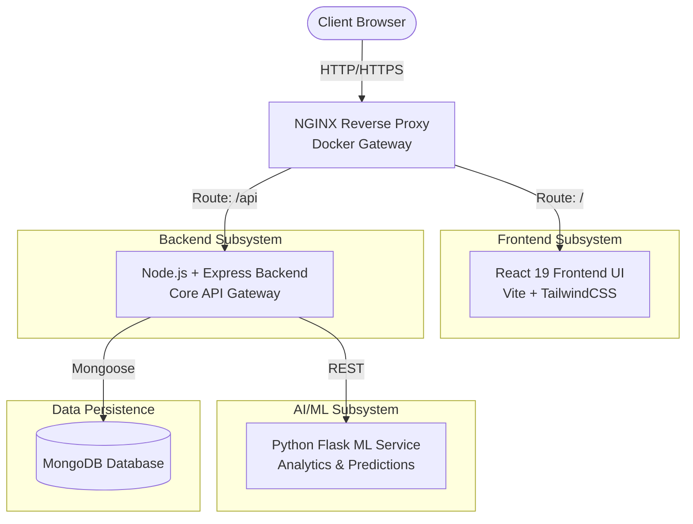

<div align="center">
  <h1>🌍 FinSight AI - Intelligent Personal Finance Tracker</h1>
  <p><em>“Not just tracking money — understanding it.”</em></p>
  <p><strong>Experience the next generation of financial tracking with predictive ML insights, dynamic goal allocation, and real-time visualization.</strong></p>
  
  <p>
    <a href="#features"><strong>Features</strong></a> ·
    <a href="#architecture"><strong>Architecture</strong></a> ·
    <a href="#quick-start-docker"><strong>Quick Start</strong></a> ·
    <a href="#manual-setup"><strong>Manual Setup</strong></a>
  </p>

  <p>
    
    
    
    
    
  </p>

  
</div>

---

## ✨ Features
FinSight AI isn't just a budget planner—it is an intelligent system adapting to your financial behavior.
- 🧠 **Predictive Financial Insights**: Python-powered ML service analyzing transaction history for future trend forecasting.
- 🎯 **Priority-Based Dynamic Goal Tracking**: Algorithmic income distribution based on goal priority and urgency.
- 💳 **Complete Transaction Management**: Log, categorize, and update income and expenses instantly.
- 📊 **Real-time Analytics Dashboard**: Interactive charts (`recharts`), automated summaries, and elegant UI.
- 🔒 **Secure Authentication**: JWT-based secure user sessions and password hashing for ultimate privacy.
- 🐳 **1-Click Containerized Setup**: A robust Production-grade Docker setup out of the box!

---

## 🏗️ Technical Architecture

FinSight AI is designed using a modern, containerized microservices architecture to ensure scalability, separation of concerns, and robust performance. 

### ⚙️ High-Level Diagram


### 🧩 Core Components

1. **Frontend UI (React 19 + TypeScript)**
   - **Framework:** Vite for blazing-fast HMR and optimized builds.
   - **Styling:** TailwindCSS for utility-first styling and a responsive UI system.
   - **Data Flow:** Dynamic state management combined with Axios for declarative API fetching.
   - **Role:** Handles user authentication flows, dynamic charts (`recharts`), and rich dashboards.

2. **Backend API (Node.js + Express.js)**
   - **Architecture:** Controller-Service-Model pattern for maintainable business logic.
   - **Authentication:** JWT (JSON Web Tokens) with `bcryptjs` password hashing.
   - **Role:** Acts as the central CRUD hub for transactions, goals, and user profiles. Invokes the ML service internally for generating smart insights.

3. **Machine Learning Microservice (Python + Flask)**
   - **Framework:** Lightweight Flask server for serving predictions via REST.
   - **Environment:** Isolated Python environment to handle data science packages.
   - **Role:** Receives sanitized transaction data from the Node API, processes trend analysis, calculates priority-based algorithmic goal distribution, and returns JSON insights.

4. **Database Layer (MongoDB)**
   - **Schema Design:** Mongoose ORM models enforcing strict relational schemas across Users, Transactions, and Savings Goals.
   - **Deployment:** Containerized single-node Mongo instance in development environments, fully compatible with MongoDB Atlas for production.

5. **Deployment & Orchestration (Docker)**
   - **Role:** Docker Compose manages multi-container application scaling.
   - **Reverse Proxy:** NGINX handles port mappings and maps external gateway requests directly to the correct internal container without exposing microservices to the public internet directly.

### 📂 Directory Structure

```text
FinSight-AI/
├── 📁 Backend/               # Node.js + Express API services
│   ├── models/             # Mongoose schemas (User, Transaction)
│   ├── routes/             # Express API endpoints
│   └── controllers/        # Business logic & ML invocations
├── 📁 Frontend/              # React 19 + TypeScript UI
│   ├── src/
│   │   ├── components/     # Reusable UI elements (charts, tables)
│   │   ├── pages/          # Dashboards and auth pages
│   │   └── store/          # React State Management
├── 📁 ML_Service/            # Python Flask microservice
│   ├── app.py              # ML REST endpoints
│   └── predictor.py        # Trend forecasting logic
├── 🐳 docker-compose.yml     # Multi-container orchestration
└── 📄 README.md              # Project documentation
```

---

## 🚀 Quick Start (Docker)
The easiest way to get FinSight AI running locally in less than 2 minutes!

**Prerequisites:** You must have [Docker](https://www.docker.com/) and [Docker Compose](https://docs.docker.com/compose/) installed on your machine.

1. **Clone the Repository**
   ```bash
   git clone https://github.com/shreyas-bhandari/FinSight-AI.git
   cd FinSight-AI
   ```
2. **Launch with Docker Compose**
   ```bash
   docker-compose up --build
   ```
   *That's it!* Docker will build the Frontend UI, start the Node Backend, provision the ML Microservice, and spin up a MongoDB instance automatically on an isolated internal bridge network.
   
3. **Access the App**
   - Head over to `http://localhost:80` in your web browser. 
   - Backend API runs at `http://localhost:5000`
   - ML Microservice API runs at `http://localhost:5001`

---

## 🛠️ Manual Setup (Development Mode)
If you wish to run the individual services locally for development:

**Prerequisite:** Make sure you have **Node.js**, **Python 3.x**, and a local running instance of **MongoDB** (or a MongoDB Atlas URI string).

### 1. Database Setup
Ensure MongoDB is running locally on `mongodb://localhost:27017` or provide your own `.env` configuration in the Backend directory.

### 2. Backend (Node.js API)
```bash
cd Backend
npm install
# Set your environment variables (PORT, MONGO_URI, JWT_SECRET, ML_API_URL)
npm run dev
```

### 3. ML Service (Python)
```bash
cd ML_Service
pip install -r requirements.txt
python app.py
```

### 4. Frontend (React / Vite)
```bash
cd Frontend
npm install
npm run dev
```
Navigate to `http://localhost:5173` to view the frontend natively.

---

## 📜 Environment variables reference
For the backend API to function correctly, make sure these env variables are accessible:
- `PORT=5000`
- `MONGO_URI=mongodb://localhost:27017/finance_tracker` (Change if not running via Docker)
- `ML_API_URL=http://localhost:5001/api/ml`
- `JWT_SECRET=super_secret_jwt_signature_key`

---

## 🤝 Contribution
Contributions, issues, and feature requests are welcome! 
Feel free to check [issues page](https://github.com/shreyas-bhandari/FinSight-AI/issues).

<div align="center">
  <sub>Built with ❤️ by tech enthusiasts for financial freedom.</sub>
</div>
